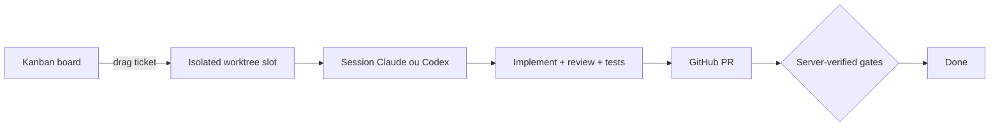

# Atelier

> Orchestrate coding agents from a kanban board. Drag a ticket across a column and a real agent — Claude Code, OpenAI Codex, or Cursor Composer — implements it end to end: isolated worktree, blocking review, local tests, GitHub PR.


## Quickstart

Download the latest `Atelier-vX.Y.Z-arm64.dmg` from [GitHub Releases](https://github.com/Antune-L/atelier/releases), open it and drag **Atelier** to Applications (macOS, Apple Silicon).

The app is not signed yet, so macOS blocks the first launch with a misleading "Atelier is damaged" dialog — clear the quarantine flag instead:

```bash
xattr -dr com.apple.quarantine /Applications/Atelier.app
```

First launch needs `git` and a logged-in Claude Code session (run `claude` once); the full pipeline also needs `tmux` and an authenticated `gh` CLI. If no `claude` install is found on the machine, the app downloads the pinned version automatically (one-time, ~220 MB).

Pour Codex, l’application réutilise la connexion Codex existante. Les modèles proposés sont GPT-6 Astra, GPT-5.6 Sol et GPT-5.6 Terra, avec les niveaux de raisonnement annoncés par le compte connecté. Claude reste disponible. Le bouton « Vérifier à nouveau », accessible dans les réglages même si Codex est indisponible, actualise la connexion et les modèles sans redémarrer l’application ; le défaut reste Terra / medium.

Pour une implémentation Codex, le modèle, l’effort et le mode FAST de l’implémenteur peuvent être distincts de ceux de l’orchestrateur. Par défaut, ils héritent des réglages Codex existants ; une valeur explicitement choisie reste indépendante. Les profils enregistrent ces choix. Les configurations sont figées au lancement et conservées lors des reprises : modifier le ticket ou les paramètres ensuite ne change pas une exécution déjà démarrée.

Le SDK et le binaire Codex sont épinglés en `0.153.4`. Les sessions interactives utilisent l’App Server du même binaire pour recevoir les messages pendant un tour, interrompre et reprendre une conversation. Les opérations PRD et Notion suivent également l’agent choisi. L’import Notion nécessite que la connexion MCP Notion soit autorisée pour ce client.

Dans les worktrees, une version numérique dans `.nvmrc` doit être installée via nvm. Cette version est appliquée à l’installation, aux scripts, aux agents et au terminal. Une version absente ou un alias non pris en charge produit un diagnostic explicite avant le lancement.

Running from source instead? See [docs/development.md](docs/development.md).

## MCP local

Atelier expose un serveur MCP Streamable HTTP sur `http://localhost:52817/mcp`. Il accepte uniquement les connexions provenant de la machine locale et exige l’en-tête `Authorization: Bearer <token>`.

Dans l’application macOS, un jeton aléatoire persistant est créé au premier lancement dans `~/Library/Application Support/kanban-agents/mcp-token`, avec des permissions limitées au compte utilisateur. La variable `KANBAN_MCP_TOKEN` permet de fournir un autre jeton au lancement. Depuis les sources, l’endpoint reste désactivé tant que cette variable n’est pas définie :

Les réglages de l’application desktop affichent l’URL MCP et permettent de copier le jeton sans l’exposer à la page web. Le bouton de régénération remplace immédiatement le jeton géré par Atelier ; il est désactivé lorsqu’un jeton est fourni par `KANBAN_MCP_TOKEN`.

```bash
KANBAN_MCP_TOKEN=remplacez-par-un-secret-long bun run dev
```

Configurez ensuite le client MCP avec l’URL ci-dessus et le jeton comme en-tête Bearer. Les outils disponibles sont `list_projects`, `list_tickets`, `create_todo_ticket`, `update_ticket`, `analyze_tickets` et `start_ticket`. Les réponses indiquent aussi `dryRun` afin qu’un agent distingue le bac à sable du serveur réel.

`create_todo_ticket` crée toujours une carte passive dans TODO. Il accepte les mêmes options qu’une création depuis l’application : contenu (`title`, `description`, `externalUrl`), pipeline (`prdEnabled`, `verifyFeature` pour la vérification E2E, `prDraft`, `autoMerge`, `stealth`, `directPush`, `addScreenshots`, `argusMultiLoop`), branche et empilement (`baseBranch`, `dependsOn`), ainsi que l’orchestrateur, l’implémenteur et leurs modèles/efforts Claude ou Codex (`orchestrator`, `implementer`, `model`, `effort`, `implementerModel`, `implementerEffort`, `codexModel`, `codexEffort`, `codexFast`, `codexImplementerModel`, `codexImplementerEffort`, `codexImplementerFast`, `feasibilityEngine`). `requestId` est obligatoire et rend la création idempotente : un nouvel appel strictement identique retourne la carte existante, tandis qu’un même identifiant avec des options différentes est refusé. Utilisez ensuite `start_ticket` pour lancer la carte ; `create_todo_ticket` refuse le champ `start`.

`analyze_tickets` reçoit une liste non vide d’identifiants et lance uniquement leur étude de faisabilité en arrière-plan. Il ne démarre aucune implémentation. La réponse distingue les identifiants acceptés (`startedIds`) des cartes absentes ou déjà occupées (`rejected`) ; les résultats de l’étude sont ensuite enregistrés sur chaque carte.

`update_ticket` modifie une carte existante tant qu’elle se trouve dans TODO et qu’aucune analyse ou implémentation n’est en cours. Il accepte le contenu et toutes les options éditables du formulaire, notamment le projet, la branche, la dépendance, les modèles, les efforts, l’orchestrateur, l’implémenteur et les options de pipeline. Un champ omis reste inchangé ; `null` et `false` sont des valeurs explicites. Cet outil ne déplace pas et ne démarre pas la carte.

## How it works



The board routes work, the backend verifies gates, and the agents do the reasoning. Each ticket acquires a slot — an isolated git worktree — and spawns a long-lived agent session owned in-process by the backend — Claude Code or OpenAI Codex, chosen per ticket; code-writing can also be delegated to Cursor Composer. The agent drives its pipeline through dedicated tools (`update_stage`, `ask_user`, `done`, `fail`). When it reports `done(pr_url)`, the backend independently verifies that the working tree is clean, the branch is pushed, and the PR exists before closing the ticket.

## Documentation

| Doc | What's inside |
| --- | --- |
| [docs/development.md](docs/development.md) | Run from source, dry-run vs real mode, env vars, desktop app, releases, required Claude Code skills |
| [docs/architecture.md](docs/architecture.md) | Source layout, agent runtime (Agent SDK), ticket flow |
| [AGENTS.md](AGENTS.md) | Guidance for coding agents working on this repository |
