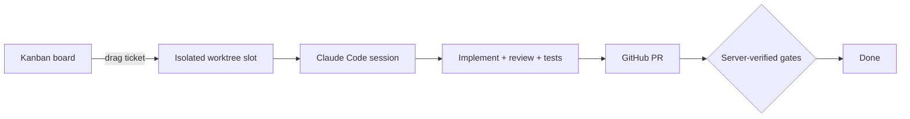

# Atelier

> Orchestrate coding agents from a kanban board. Drag a ticket across a column and a real agent — Claude Code, OpenAI Codex, or Cursor Composer — implements it end to end: isolated worktree, blocking review, local tests, GitHub PR.


## Quickstart

Download the latest `Atelier-vX.Y.Z-arm64.dmg` from [GitHub Releases](https://github.com/Antune-L/atelier/releases), open it and drag **Atelier** to Applications (macOS, Apple Silicon).

The app is not signed yet, so macOS blocks the first launch with a misleading "Atelier is damaged" dialog — clear the quarantine flag instead:

```bash
xattr -dr com.apple.quarantine /Applications/Atelier.app
```

First launch needs `git` and a logged-in Claude Code session (run `claude` once); the full pipeline also needs `tmux` and an authenticated `gh` CLI. If no `claude` install is found on the machine, the app downloads the pinned version automatically (one-time, ~220 MB).

Running from source instead? See [docs/development.md](docs/development.md).

## How it works



The board routes work, the backend verifies gates, and the agents do the reasoning. Each ticket acquires a slot — an isolated git worktree — and spawns a long-lived agent session owned in-process by the backend — Claude Code or OpenAI Codex, chosen per ticket; code-writing can also be delegated to Cursor Composer. The agent drives its pipeline through dedicated tools (`update_stage`, `ask_user`, `done`, `fail`). When it reports `done(pr_url)`, the backend independently verifies that the working tree is clean, the branch is pushed, and the PR exists before closing the ticket.

## Documentation

| Doc | What's inside |
| --- | --- |
| [docs/development.md](docs/development.md) | Run from source, dry-run vs real mode, env vars, desktop app, releases, required Claude Code skills |
| [docs/architecture.md](docs/architecture.md) | Source layout, agent runtime (Agent SDK), ticket flow |
| [AGENTS.md](AGENTS.md) | Guidance for coding agents working on this repository |
