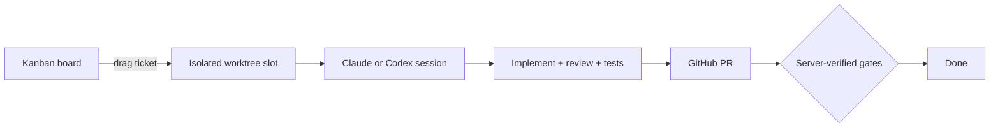

# Atelier

> Orchestrate coding agents from a kanban board. Drag a ticket into a column and a real agent — Claude Code, OpenAI Codex, or Cursor Composer — implements it end to end: isolated worktree, blocking review, local tests, GitHub PR.


## Quickstart

Download the latest `Atelier-vX.Y.Z-arm64.dmg` from [GitHub Releases](https://github.com/Antune-L/atelier/releases), open it and drag **Atelier** to Applications (macOS, Apple Silicon).

The app is not signed yet, so macOS blocks the first launch with a misleading "Atelier is damaged" dialog — clear the quarantine flag instead:

```bash
xattr -dr com.apple.quarantine /Applications/Atelier.app
```

First launch needs `git` and a logged-in Claude Code session (run `claude` once); the full pipeline also needs `tmux` and an authenticated `gh` CLI. If no `claude` install is found on the machine, the app downloads the pinned version automatically (one-time, ~220 MB).

For Codex, the app reuses the existing Codex connection. The available models are GPT-6 Astra, GPT-5.6 Sol, GPT-5.6 Luna and GPT-5.6 Terra, with the reasoning levels advertised by the connected account. Claude remains available. The « Vérifier à nouveau » (check again) button stays available in the settings even when Codex is unreachable; it refreshes the connection and the model list without restarting the app. The default stays Terra / medium.

For a Codex implementation, the implementer's model, effort and FAST mode can differ from the orchestrator's. By default they inherit the existing Codex settings; an explicitly chosen value stays independent. Profiles store these choices. Configurations are frozen at launch and kept across resumes: editing the ticket or the settings afterwards does not change a run that has already started.

The Codex SDK and binary are pinned to `0.153.4`. Interactive sessions use that same binary's App Server to receive messages during a turn, interrupt a turn and resume a conversation. Notion import also follows the chosen agent and requires the Notion MCP connection to be authorized for this client.

In worktrees, the numeric version declared in `.nvmrc` must be installed via nvm. That version is then applied to the install, the scripts, the agents and the terminal. A missing version or an unsupported alias produces an explicit diagnostic before launch.

Running from source instead? See [docs/development.md](docs/development.md).

## Local MCP

Atelier exposes a Streamable HTTP MCP server on `http://localhost:52817/mcp`. It only accepts connections coming from the local machine and requires the `Authorization: Bearer <token>` header.

In the macOS app, a persistent random token is created at first launch in `~/Library/Application Support/kanban-agents/mcp-token`, with permissions restricted to the user account. The `KANBAN_MCP_TOKEN` variable lets you supply another token at launch. From source, the endpoint stays disabled as long as that variable is not set:

```bash
KANBAN_MCP_TOKEN=replace-with-a-long-secret bun run dev
```

Then configure the MCP client with the URL above and the token as a Bearer header. The available tools are `list_projects`, `list_tickets`, `create_todo_ticket`, `update_ticket`, `analyze_tickets` and `start_ticket`. Responses also report `dryRun` so that an agent can tell the sandbox apart from the real server.

The desktop app settings show the MCP URL and let you copy the token without exposing it to the web page. The regenerate button immediately replaces the token managed by Atelier; it is disabled when a token is supplied through `KANBAN_MCP_TOKEN`.

`create_todo_ticket` always creates a passive card in TODO. It accepts the same options as creating one from the app: content (`title`, `description`, `externalUrl`), pipeline (`prdEnabled`, `verifyFeature` for E2E verification, `prDraft`, `autoMerge`, `stealth`, `directPush`, `addScreenshots`, `argusMultiLoop`), branch and stacking (`baseBranch`, `dependsOn`), as well as the orchestrator, the implementer and their Claude or Codex models/efforts (`orchestrator`, `implementer`, `model`, `effort`, `implementerModel`, `implementerEffort`, `codexModel`, `codexEffort`, `codexFast`, `codexImplementerModel`, `codexImplementerEffort`, `codexImplementerFast`, `feasibilityEngine`). `requestId` is mandatory and makes creation idempotent: a strictly identical new call returns the existing card, while the same identifier with different options is rejected. Use `start_ticket` afterwards to launch the card; `create_todo_ticket` rejects the `start` field.

`analyze_tickets` takes a non-empty list of identifiers and starts only their feasibility study in the background; it starts no implementation. The response separates accepted identifiers (`startedIds`) from missing or already busy cards (`rejected`); the study results are then recorded on each card.

`update_ticket` edits an existing card as long as it sits in TODO and no analysis or implementation is running. It accepts the content and every editable option in the form, in particular the project, the branch, the dependency, the models, the efforts, the orchestrator, the implementer and the pipeline options. An omitted field stays unchanged; `null` and `false` are explicit values. This tool neither moves nor starts the card.

## How it works



The board routes work, the backend verifies gates, and the agents do the reasoning. Each ticket acquires a slot — an isolated git worktree — and spawns a long-lived agent session owned in-process by the backend — Claude Code or OpenAI Codex, chosen per ticket; code-writing can also be delegated to Cursor Composer. The agent drives its pipeline through dedicated tools (`update_stage`, `ask_user`, `done`, `fail`). When it reports `done(pr_url)`, the backend independently verifies that the working tree is clean, the branch is pushed, and the PR exists before closing the ticket.

## Documentation

| Doc | What's inside |
| --- | --- |
| [docs/development.md](docs/development.md) | Run from source, dry-run vs real mode, env vars, desktop app, releases, required Claude Code skills |
| [docs/architecture.md](docs/architecture.md) | Source layout, agent runtime (Agent SDK), ticket flow |
| [AGENTS.md](AGENTS.md) | Guidance for coding agents working on this repository |
